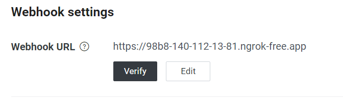

# ChatGPT generate FAQ for an introduction of a paaer 

## 1. Create your own LINE message API account
https://developers.line.biz/en/

reference: https://ithelp.ithome.com.tw/articles/10192928

## 2. Download ngrok to support "https"
https://ngrok.com/download

## 3. Run ngrok 
Open a terminal and cd to the directory where you put ngrok.exe. 

Command on the terminal: "ngrok http 5002", and keep the terminal on.

## 4. Copy an address to LINE Webhook URL 
After step 3, you will see an address which is "https:XXX.ngrok-free.app" behind the line  "Forwarding".

Please copy "https:XXX.ngrok-free.app" and paste on LINE Webhook URL. 

## 5. Run ChatGPT on Line bot
Remember to update your own OpenAI API key, Line bot Channel secret, and Line bot Channel access token in ChatGPTonLINE.py.

Open another terminal and command: "python ChatGPTonLINE.py", and keep the terminal on.

After you run "ChatGPTonLINE.py", you can verify if your Webhook URL is successful and test your line bot.

